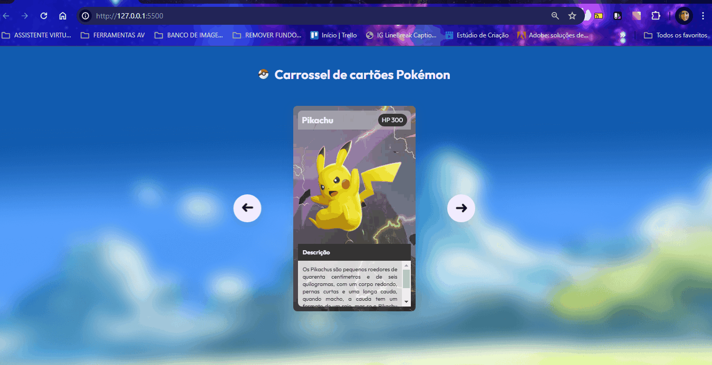
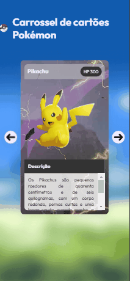

# Projeto Carrossel de cartões Pokémon

Um projeto com 3 cartões de Pokémons contendo a descrição de cada um com seus nomes e setas clicáveis de avançar e voltar  para que apareçam para telas de desktops e celulares 📲💻

## Tecnologias utilizadas
- HTML
- CSS
- JAVASCRIPT

## 📂 Acesso ao projeto

Você pode acessar o código fonte do projeto 

<>